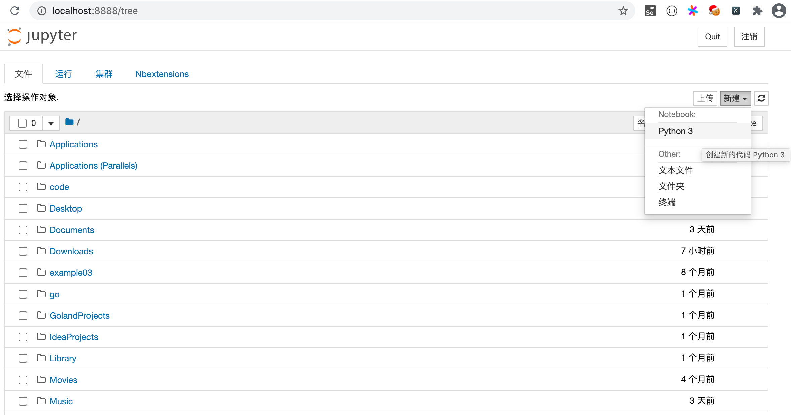
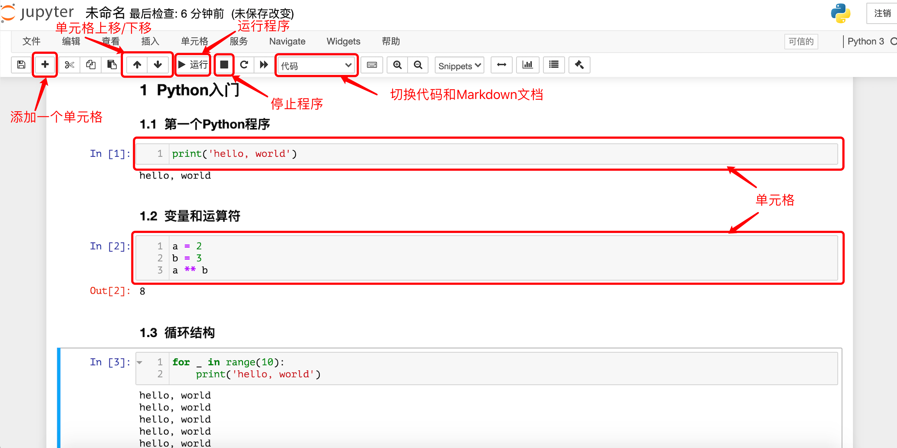

## DataAnalysisNotes
### 数据分析相关库
使用Python从事数据科学相关的工作是一个非常棒的选择，因为Python整个生态圈中，有大量的成熟的用于数据科学的软件包（工具库）。而且不同于其他的用于数据科学的编程语言（如：Julia、R），Python除了可以用于数据科学，能做的事情还很多，可以说Python语言几乎是无所不能的。

#### 三大神器
1. NumPy：支持常见的数组和矩阵操作，通过ndarray类实现了对多维数组的封装，提供了操作这些数组的方法和函数集。由于NumPy内置了并行运算功能，当使用多核CPU时，Numpy会自动做并行计算。
2. Pandas：pandas的核心是其特有的数据结构DataFrame和Series，这使得pandas可以处理包含不同类型的数据的负责表格和时间序列，这一点是NumPy的ndarray做不到的。使用pandas，可以轻松顺利的加载各种形式的数据，然后对数据进行切片、切块、处理缺失值、聚合、重塑和可视化等操作。
3. Matplotlib：matplotlib是一个包含各种绘图模块的库，能够根据我们提供的数据创建高质量的图形。此外，matplotlib还提供了pylab模块，这个模块包含了很多像MATLAB一样的绘图组件。

#### 其他相关库
1. SciPy：完善了NumPy的功能，封装了大量科学计算的算法，包括线性代数、稀疏矩阵、信号和图像处理、最优化问题、快速傅里叶变换等。
2. Seaborn：Seaborn是基于matplotlib的图形可视化工具，直接使用matplotlib虽然可以定制出漂亮的统计图表，但是总体来说还不够简单方便，Seaborn相当于是对matplotlib做了封装，让用户能够以更简洁有效的方式做出各种有吸引力的统计图表。
3. Scikit-learn：Scikit-learn最初是SciPy的一部分，它是Python数据科学运算的核心，提供了大量机器学习可能用到的工具，包括：数据预处理、监督学习（分类、回归）、无监督学习（聚类）、模式选择、交叉检验等。
4. Statsmodels：包含了经典统计学和经济计量学算法的库。

#### 安装和使用Anaconda
如果希望快速开始使用Python处理数据科学相关的工作，建议大家直接安装Anaconda，它是工具包最为齐全的Python科学计算发行版本。对于新手来说，先安装官方的Python解释器，再逐个安装工作中会使用到的库文件会比较麻烦，尤其是在Windows环境下，经常会因为构建工具或DLL文件的缺失导致安装失败，而一般新手也很难根据错误提示信息采取正确的解决措施，容易产生严重的挫败感。

对于个人用户来说，可以从Anaconda的官方网站下载它的“个人版（Individual Edition）”安装程序，安装完成后，你的计算机上不仅拥有了Python环境和Spyder（类似于PyCharm的集成开发工具），还拥有了与数据科学工作相关的近200个工具包，包括我们上面提到的那些库。除此之外，Anaconda还提供了一个名为conda的包管理工具，通过这个工具不仅可以管理Python的工具包，还可以用于创建运行Python程序的虚拟环境。

可以通过Anaconda官网提供的下载链接选择适合自己操作系统的安装程序，建议大家选择图形化的安装程序，下载完成后双击安装程序开始安装。

#### conda命令
如果希望使用conda工具来管理依赖项或者创建项目的虚拟环境，可以在终端或命令行提示符中使用conda命令。Windows用户可以在“开始菜单”中找到“Anaconda3”，然后点击“Anaconda Prompt”来启动支持conda的命令行提示符。macOS用户建议直接使用“Anaconda-Navigator”中的“Environments”，通过可视化的方式对虚拟环境和依赖项进行管理。

1. 版本和帮助信息。 
    - 查看版本：conda -V或conda --version 
    - 获取帮助：conda -h或conda --help
    - 相关信息：conda list 
   

2. 虚拟环境相关。
    - 显示所有虚拟环境：conda env list
    - 创建虚拟环境：conda create --name venv
    - 指定Python版本创建虚拟环境：conda create --name venv python=3.7
    - 指定Python版本创建虚拟环境并安装指定依赖项：conda create --name venv python=3.7 numpy pandas
    - 通过克隆现有虚拟环境的方式创建虚拟环境：conda create --name venv2 --clone venv
    - 分享虚拟环境并重定向到指定的文件中：conda env export > environment.yml
    - 通过分享的虚拟环境文件创建虚拟环境：conda env create -f environment.yml
    - 激活虚拟环境：conda activate venv
    - 退出虚拟环境：conda deactivate
    - 删除虚拟环境：conda remove --name venv --all
    > 说明：上面的命令中，venv和venv2是虚拟环境文件夹的名字，可以将其替换为自己喜欢的名字，但是强烈建议使用英文且不要出现空格或其他特殊字符。


3. 包（三方库或工具）管理。
    - 查看已经安装的包：conda list
    - 搜索指定的包：conda search matplotlib
    - 安装指定的包：conda install matplotlib
    - 更新指定的包：conda update matplotlib
    - 移除指定的包：conda remove matplotlib
    > 说明：在搜索、安装和更新软件包时，默认会连接到官方网站进行操作，如果觉得速度不给力，可以将默认的官方网站替换为国内的镜像网站，推荐使用清华大学的开源镜像网站。将默认源更换为国内镜像的命令是：conda config --add channels https://mirrors.tuna.tsinghua.edu.cn/anaconda/pkgs/free/ 。如果需要换回默认源，可以使用命令conda config --remove-key channels。


#### 使用Notebook
如果已经安装了Anaconda，macOS用户可以按照上面所说的方式在“Anaconda-Navigator”中直接启动“Jupyter Notebook”（以下统一简称为Notebook）。Windows用户可以在“开始菜单”中找到Anaconda文件夹，接下来选择运行文件夹中的“Jupyter Notebook”就可以开始数据科学的探索之旅。

对于安装了Python环境但是没有安装Anaconda的用户，可以用Python的包管理工具pip来安装jupyter，然后在终端（Windows系统称之为命令行提示符）中运行jupyter notebook命令来启动Notebook，如下所示。

安装Notebook：
```shell
pip install jupyter
```

安装三大神器：
```shell
pip install numpy pandas matplotlib
```

运行Notebook：
```shell
jupyter notebook
```

Notebook是基于网页的用于交互计算的应用程序，可以用于代码开发、文档撰写、代码运行和结果展示。简单的说，你可以在网页中直接编写代码和运行代码，代码的运行结果也会直接在代码块下方进行展示。如在编写代码的过程中需要编写说明文档，可在同一个页面中使用Markdonw格式进行编写，而且可以直接看到渲染后的效果。此外，Notebook的设计初衷是提供一个能够支持多种编程语言的工作环境，目前它能够支持超过40种编程语言，包括Python、R、Julia、Scala等。

首先，我们可以创建一个用于书写Python代码的Notebook:


接下来，我们就可以编写代码、撰写文档和运行程序啦，如下图所示:


Notebook使用技巧
如果使用Python做工程化的项目开发，PyCharm肯定是最好的选择，它提供了一个集成开发环境应该具有的所有功能，尤其是智能提示、代码补全、自动纠错这类功能会让开发人员感到非常舒服。如果使用Python做数据科学相关的工作，Notebook并不比PyCharm逊色，在数据和图表展示方面Notebook更加优秀。这个工具的使用非常简单，大家可以看看Notebook菜单栏，相信理解起来不会有太多困难，在知乎上有一篇名为[《最详尽使用指南：超快上手Jupyter Notebook》](https://zhuanlan.zhihu.com/p/32320214) 的文章，也可以帮助大家快速认识Notebook。